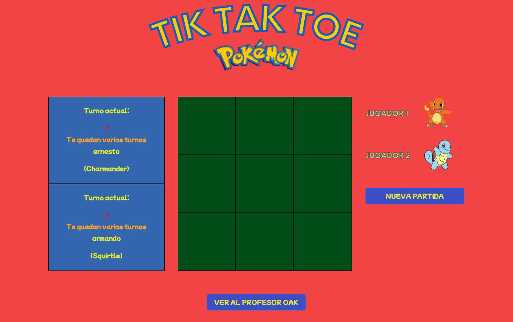
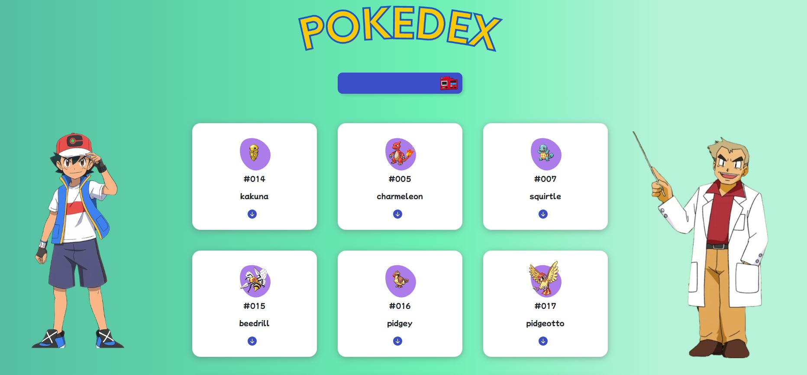

# Juego tik tak toe

## Índice
1. Descripción del proyecto

2. Estado del proyecto

3. Características de la aplicación y demostración

4. Acceso al proyecto

5. Tecnologías utilizadas

6. Personas Contribuyentes

7. Personas-Desarrolladores del Proyecto

8. Licencia

9. Conclusión
  
### Descripción del proyecto
Proyecto desarrollado para la tercera entrega de proyectos del bootcamp geekshubsacademy el cual consiste en la realización de la recreación del juego tik tak toe dándole un estilo propio y totalmente responsive.

Juego tik tak toe completamente funcional para 2 jugadores con minijuegos extra como el paseo del profesor oak o la pokedex.
|Página principal|Reglas de juego| Página de elección de jugador|
|-|-|-|
||| |

|Tablero de juego|Fichas de juego| Página de ganador|
|-|-|-|
||| |

|Paseo del profesor Oak|Pokedex oculta| Datos extra pokedex|
|-|-|-|
||| |

|Información extra pokedex|Versión móvil pokedex| version móvil tablero| 
|-|-|-|
||| |

### Estado del proyecto
Proyecto en construcción.
### Características de la aplicación y demostración
Funcionalidad 1: Jugabilidad total respecto al tik tak toe con 3 fichas posibles por jugador y sin posibilidad de empate.

Funcionalidad 2: Posibilidad de elección de nombre para los 2 jugadores asi como de elección de personaje.

Funcionalidad 3: Numero ilimitado de partidas a jugar. 

Funcionalidad 4: Pagina de ganador personalizada.

Funcionalidad 5: Juego extra (paseo del profesor oak) donde puedes desbloquear el acceso a la pokedex mediante un minijuego de recolección.

Funcionalidad 6: Acceso a una pokedex completa, si se consigue finalizar el minijuego mencionado anteriormente, con información traida directamente desde la pokeApi.
### Acceso al proyecto
https://github.com/solsona1008/asm.geekshubs-fsd-val-TIK-TAK-TOE
### Tecnologías utilizadas
* HTML 5
* CSS
* BOOTSTRAP
* JS
### Personas Contribuyentes
Usuario de github: solsona1008 (único contribuyente al proyecto).
### Licencia
MIT License
### Conclusión
Se logró plantear y elaborar el objetivo propuesto de la creación de un juego tik tak toe. En él se abordaron los principales aspectos del proyecto como que todas las partes del juego se realizaran mediante las tecnologías de HTML, CSS y JS vanilla principalmente, fueran totalmente responsive, asi como que cuente con funcionalidades de registro de los nombres de jugadores, solo se puedan jugar 3 fichas por jugador, 1 por turno y solo se pueda seleccionar la ficha correspondiente al turno del
jugador correspondiente. También se ha añadido contenido adicional a partir del proposito inicial para crear una especie de minijuego dentro del propio juego, para que la inmersión del jugador con la temática en la que esta basada el juego sea mucho mas inmersiva.

Se logró identificar los principales problemas de diseño responsive, los diversos problemas que surgieron especialmente con las mecánicas de movimiento y colisión en el paseo del profesor Oak y las dificultades con el consumo de la api en la pokedex que se consiguieron abordar de manera adecuada para que estuviesen correctamente ejecutadas todas las funcionalidades previstas en el diseño base del proyecto.
